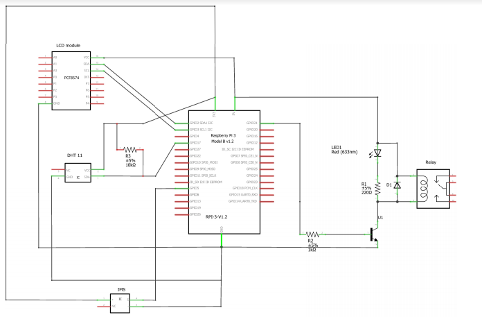
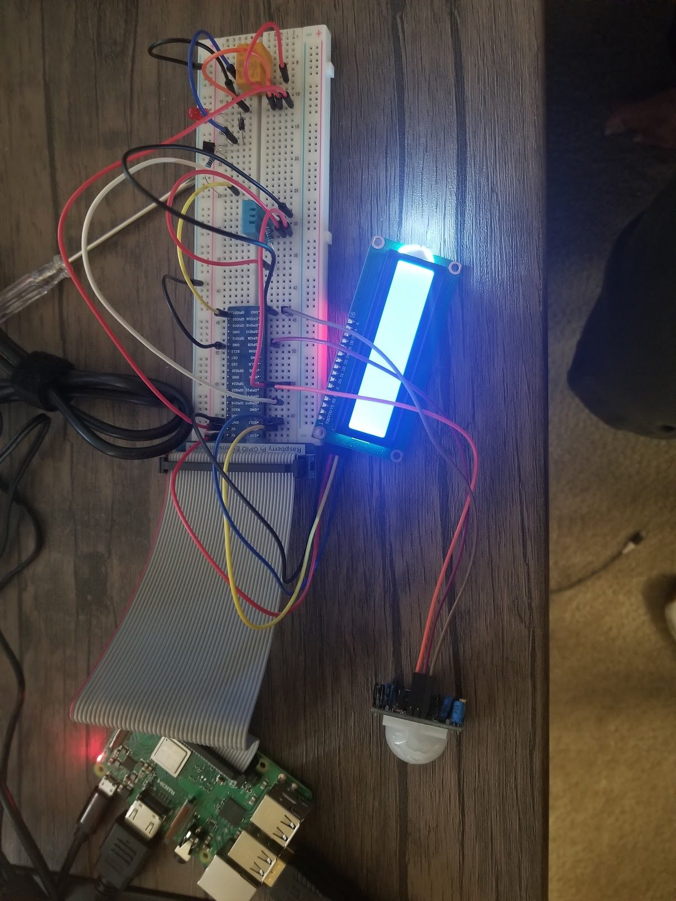

# Weather Monitoring System

Developed a Raspberry Pi based IoT device to implement a weather monitoring system. The data from this 
monitoring system determines the water to be needed to irrigate and to “turn on” a virtual sprinkler system.

## Project Specifications

This weather monitoring system has the following features:
1. Sense temperature and humidity every minute and generate hourly averages of those quantities. Display
the values on the LCD.
2. Connect over the internet every hour and extract CIMIS data from the closest station (Irvine).
3. Adjust the CIMIS-computed ET value based on the hourly-averaged temperature and humidity.
4. Display a rolling message on the LCD comparing CIMIS provided temperature and humidity values with
the locally computed ET values, and display either the water savings or water deficit.
5. Sense movement using a PIR and turn off the sprinkler to avoid wetting the person/animal. The LCD
should reflect this "interrupted" state.

## Source Code Description

### Main Program
The main code, defined by the _main.py_ file, is the driver for the weather monitoring system. This file
stitches the python modules that define the peripherals in such a way that any weather based information
will be processed and displayed on the LCD, and depending on the time of day, will activate a sprinkler
system to irrigate a plot of lawn.
The processes defined in the run function are constantly looped to continuously run the weather monitoring
system. The loop has three states defined below:  
1. Constantly run and display data to LCD when the irrigation system is off.  
2. Display existing data while the irrigation is on, and listen for any movement.  
3. When movement detected, update the display to reflect the detection and pause irrigation.

### CIMIS Data Extraction
The CIMIS data extraction, defined by the _cimis.py_ file, sends requests to the CIMIS data store so to
parse the data which is processed by the irrigation system. Specifically, It sends HTTP GET requests to 
the CIMIS for three parameters:  
* _HlyEto_: the hourly ETo.  
* _HlyAirTmp_: the hourly air temperature.  
* _HlyRelHum_: the hourly relative humidity.  

If these parameters exist, they are returned to the irrigation system; otherwise, some default prediction
values are sent.

### LCD Display
The LCD display, defined by the _lcd.py_ file, sets up the relevant Raspberry Pi module. It instantiates 
the LCD object, and defines the port extension to an I2C address. The actual LCD calls occur in the _main.py_ 
file.
* _Adafruit LCD & PCF8574_  
To have the LCD run only two pins using the serial ports on the Raspberry Pi, utilize the PCF8574 extension.
The Adafruit LCD defines specific functions to make writing to the LCD easier.

### DHT11 Weather Monitoring
The DHT11 weather monitoring, defined by the _DTH11.py_ file, measures the surrounding air and generates a
digital signal on the respective data pin (no analog inputs needed). It's used to sense both the local 
temperature and local relative humidity. 
* _Freenove_DHT_  
This file defines specific functions to make reading from the DHT11 sensor easier.

### PIR Motion Sensor
The PIR motion sensor, defined by the _PIR.py_ file, is used to detect heat signals and send the appropriate
signals to the main module to pause the system.

## Circuit Schematic Description

### LCD Peripheral
The LCD (_LCD1602_) is connected to the Raspberry Pi via serial to the parallel extension _PCF8574_. This 
enables us to drive the LCD using only two GPIO pins (_SDA1_, _SCL1_).

### Relay Peripheral
The relay is used to drive external circuits; here, the connected LED (D1) shows whether or not the relay
is active. The relay connects to one GPIO pin (_GPIO21_).

### DHT11 Peripheral
The DHT11 measures the surrounding temperature and humidity by using a thermistor and a capacitive humidity
sensor. It calculates the relative humidity by mesuring the electrical resistance between two electrodes. 
The DHT11 connects to one GPIO pin (_GPIO17_).

### Infrared Motion Sensor Peripheral
The IMS detects movement in its vicinity. It consists of a fresnel lens, an infrared detector, and 
supporting detection circuitry. Most animals generate discernable infrared heat that the detector can
recognize. The lens on the sensor focuses any infrared radiation present towards the infrared detector.
The IMS connects to one GPIO pin (_GPIO5_).  

## Additional Resources

The above image depicts the completed circuit. The relay is not currently connected to the sprinkler 
system, but rest assured, the project works as intended. The below video is a demonstration of how 
the monitoring system may theoretically function (Note: click on the image below; GitHub can't seem
to render local videos properly).

  

